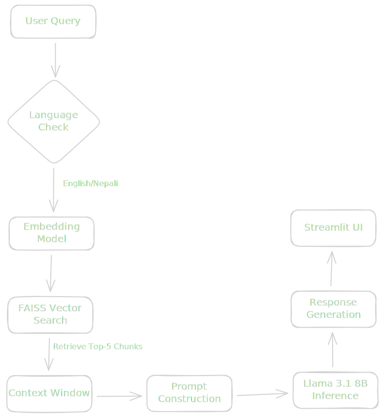

### 1. System Overview

**Project Name:** Nepali News RAG Chatbot <br>
**Goal:** A retrieval-augmented generation system capable of answering queries in English or Nepali based on a dataset of 10k+ Nepali news articles. <br>

**Stack:**
* **Environment:** Google Colab (Free Tier T4 GPU)
* **LLM:** `meta-llama/Meta-Llama-3.1-8B-Instruct` (4-bit Quantized via `bitsandbytes`)
* **Orchestration:** LangChain
* **Vector Store:** FAISS (CPU)
* **Embedding Model:** `sentence-transformers/paraphrase-multilingual-MiniLM-L12-v2`
* **UI:** Gradio

### 2. Architecture Diagram


### 3. Data Pipeline & Logic

1. **Ingestion:**
* Load `np20ng` dataset.
* **Cleaning:** Fix encoding artifacts (`¥`  `र्`), normalize Unicode (`NFKC`), collapse whitespace.


2. **Chunking Strategy:**
* **Splitter:** `RecursiveCharacterTextSplitter`
* **Separators:** `["\n\n", "\n", " ।", "।", "|", " ", ""]` (Priority given to Nepali Purna Viram).


3. **Indexing:**
* Embed chunks using `paraphrase-multilingual-MiniLM-L12-v2` (384 dimensions).
* Store in FAISS (FlatL2 index for accuracy, IVF for speed if >50k docs).


### 4. Design Constraints (The Math)

*Based on preliminary experiments (1 Feb 2026):*

* **Token Ratio:** 0.55 tokens/char (Nepali) vs 0.24 tokens/char (English).
* **Max Context Window:** 8192 tokens (Llama 3 default).
* **Chunk Size:** 1000 characters ( 550 tokens).
* **Chunk Overlap:** 200 characters.
* **Retrieval Count (k):** 5 documents.
* **Total Input Context:**  tokens.
* **Safety Margin:** Leaves  5000 tokens for system prompt + user query + generated answer. **Safe from OOM.**

### 5. Prompt Engineering

We use the strict Llama-3 instruct format to prevent mode collapse.

**Template:**

```text
<|begin_of_text|><|start_header_id|>system<|end_header_id|>
You are a helpful AI assistant for Nepali News.
Use the following pieces of retrieved context to answer the user's question.
If the answer is not in the context, strictly say "I cannot find the answer in the provided news."
Keep the answer concise and factual.

Context:
{context}

Answer in the following language: {target_language}
<|eot_id|><|start_header_id|>user<|end_header_id|>
{question}
<|eot_id|><|start_header_id|>assistant<|end_header_id|>

```

### 6. User Interface (Streamlit)

**Inputs:**

1. `Query` (Textbox)
2. `Response Language` (Radio: "Nepali", "English") - *Controls the `{target_language}` variable in prompt.*

**Outputs:**

1. `Answer` (Markdown Text)
2. `Sources` (JSON/Text: List of headlines + similarity scores).

### 7. Future Scalability / Limitations

* **Storage:** Current in-memory FAISS works for <100k docs. For >1M, migrate to Pinecone or Weaviate.
* **Latency:** CPU indexing is slow; move to GPU index if ingestion takes >10 mins.
* **Multi-turn:** Currently stateless (Single QA). Phase 2.5 can add conversation memory.
